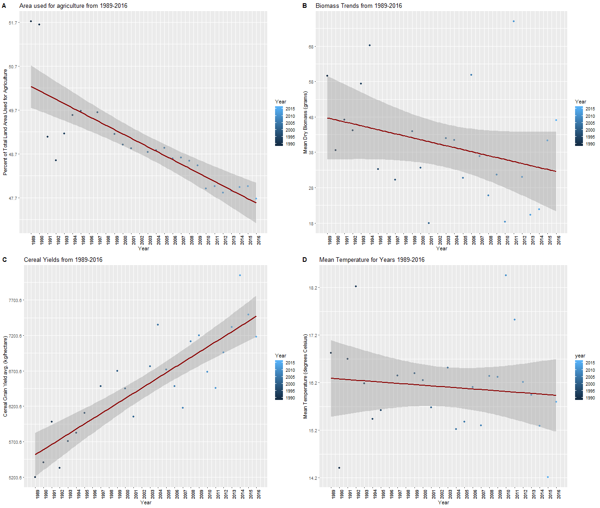
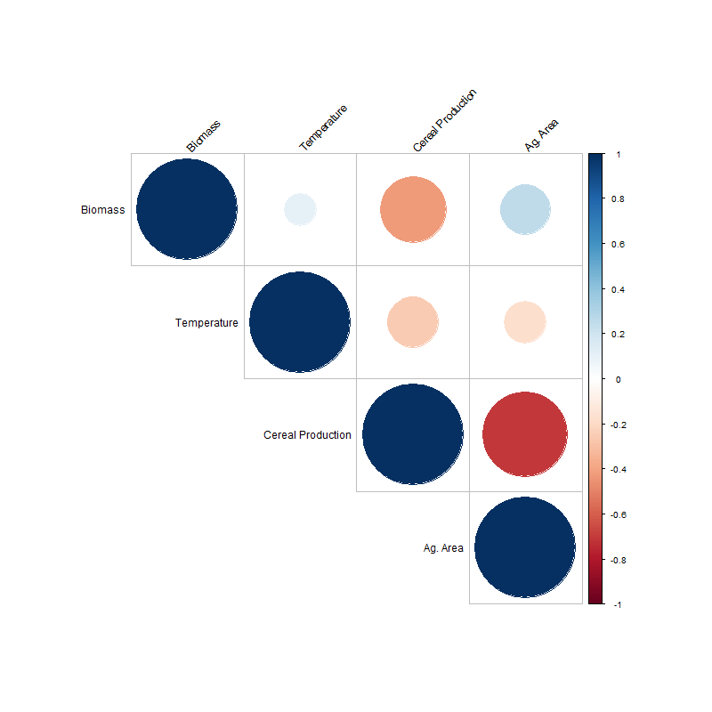
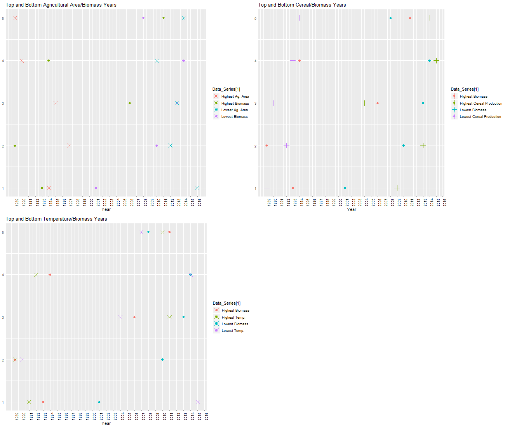

# Effect of Agriculture on Insect Populations
### Study Question
Is there a correlation between increased agricultural area or farming practices and observed decline in insect populations? 

## Context
In multiple worldwide ecosystems, flying insects have experienced sustained population decline in biomass across a period of several decades. This decline has potentially far-reaching and cascading implications for ecological stability, since flying insects are the foundation of most terrestrial food webs and are pollinators of many agricultural species. Intensified cereal grain agriculture and its associated ecological consequences, such as habitat destruction and loss of plant diversity, are a potential cause of this decline (Benton et al. 2016, 671-673).

Study of this phenomenon is an urgent, ongoing topic of interest by ecologists and agricultural stakeholders. While public focus has lingered on the restoration of charismatic species such as honeybees, long-running collection studies indicate a broader issue. From 1989 to 2016, German scientists recorded insect biomass readings in protected nature areas. Their headline-reaching study showed that insect populations dropped 76% over the course of the study (Hallmann et al. 2016, 14-18). This analysis seeks to examine insect biomass data and find potential correlations to agricultural trends. 
## Methods
#### Source of Original Study Data
Insect biomass and temperature data were retrieved from the study "More than 75 percent decline over 27 years in total flying insect biomass in protected areas," published in the journal PLOS in 2016. This publication is open-source and can be accessed at  [the PLOS website.](https://journals.plos.org/plosone/article?id=10.1371/journal.pone.0185809)

Insect biomass data can be directly accessed at the above study's [S1 dataset](https://doi.org/10.1371/journal.pone.0185809.s004). Temperature data is available in the study's [S2 dataset](https://doi.org/10.1371/journal.pone.0185809.s005) as of May 1st, 2019.

Agricultural percent use data were sourced from [The World Bank's publicly available data]([https://data.worldbank.org/indicator/AG.LND.AGRI.ZS?end=2016&locations=DE&start=1989](https://data.worldbank.org/indicator/AG.LND.AGRI.ZS?end=2016&locations=DE&start=1989)). Cereal production per hectare data are also available from [The World Bank's archives](https://data.worldbank.org/indicator/AG.CON.FERT.ZS?locations=DE&view=chart) as of May 1st, 2019.

#### How the Original Data were Produced

From 1989 to 2016, German ecologists conducted a study to measure change in insect biomass across multiple field locations in protected park areas of Germany. These regions are similar to the United States' National Park systems, and are intended to preserve native habitats for animal and plant species. The researchers' stated goal was to observe insect population trends within the park.

Insect biomass was measured using specialized “malaise” traps; the collected flying insects were regularly collected, weighed, and recorded. These data were recorded in the  [S1 dataset](https://doi.org/10.1371/journal.pone.0185809.s004). Correlation analysis of the insect biomass weight data began when a consistent decline was noted. Since changes in climate conditions were suspected to correlate with population decline, several weather-related factors at the field locations were compared to the trends in insect biomass. These data were sourced from local weather stations in Germany. Temperature and weather data is available in the  [S2 dataset](https://doi.org/10.1371/journal.pone.0185809.s005). 

For the purpose of this analysis, novel agricultural data was compared against Hallman et al.'s insect biomass data. Agricultural data obtained from the World Bank is collected and compiled from local governments around the world in countries with World Bank offices. Compiled data for the 27-year study period is available in this analysis' git repository at the following links: [Cereal production per hectare](/cereal_yield_per_hectare.csv) and [Agricultural percent area](/land_use_percentages.csv). Full worldwide archives are available in the previous section's links. 

The S1 dataset is 109 KB in size and 1513 lines long. The S2 dataset is 2.18 MB in size and 16,909 lines long. The two agricultural data sets are under 400 bytes and 29 lines long. Minor data revision and compression was necessary in order to compile this analysis. 

#### Original Study's Data Analysis Protocol
The original authors ran a JAGS test using R, and used values including R2 and standard deviation to determine the correlation between insect biomass and a list of weather-related variables. In addition to the temperature data used in this analysis, the original authors also studied precipitation, wind speed, pH, and local plant species diversity. 

In addition to the focus on what relation biomass loss had to environmental variables, the authors ran an in-depth analysis of yearly and seasonal insect biomass trends  at the various trap locations. Besides the reported overall trend of 76% biomass decline, they used this method to find declines as high as 82% during the warm season, and a yearly decline rate of up to 6% (Hallman et al. 2016, 10-14). Population decline was not strongly linked to weather-related factors; the study's authors urged research into other possible correlations. 

#### Summary of This Analysis' Protocol
This analysis had three primary focus areas: 
- First, I wanted to shrink down the large original data sets to obtain a small quantity of yearly mean data points. This procedure was intended to provide an easily workable data set for future researchers' analyses. 
- Second, I wanted to determine what correlation existed between biomass and three related variables: agricultural area, cereal production, and mean change in temperature. Agricultural data was not studied in the original research's data analysis protocol.
- Third, I wanted to graph the data and compare the correlation in a visually simple and intuitive way. This process was intended to provide laymen and other researchers with a simpler way to analyze correlation data. 

To accomplish the first point of focus, I used several TidyVerse functions, including group_by and arrange, to easily sort the out-of-order years in the original study's first data set (S1). I took the mean of biomass for the 25 years for which data existed. I used the same method on the original study's second data set. This procedure produced a smoother, more easily-interpretable data file. 

The two external agricultural data sets compared against biomass, agricultural area and cereal production, were sourced from the World Bank data archives. The website's drag-and-drop menus allow for production of a visual graph that includes data point values for each year. However, individual data points were not publicly available; this limited the use of World Bank data for quantitative analysis. To resolve this issue, I compiled 27 years of data using Microsoft Excel. This data file contains two columns: Year and Percent Agricultural Area or Cereal Yield per Hectare, respectively. In order to directly compare this data to Hallman et al.'s study period, years without recorded data were removed prior to analysis. 

To accomplish the second focal point, Pearson correlation tests were performed on biologically relevant data pairs using the aforementioned formatted data sets. This procedure was selected for its intuitive and broadly understood data output, as well as its potential applicability to the original authors' comparisons. 

To accomplish the third point, data analysis was performed using the packages ggplot2, Hmisc, and corrplot. Ggplot2 was used to simplify the graphing of each data set as a scatterplot with a trendline. Hmisc and corrplot were used to visualize the correlation found between each set of variables with a correlogram; this provides a visually-appealing and intuitive display of correlation p values. Finally, this analysis took the highest and lowest recorded years for biomass and compared them to the most extreme years for each other variable (temperature, agricultural area, and cereal production) to check for trends regarding extremes. 
## Results and Conclusions
### Results 
The general trends for temperature, insect biomass, cereal yield, and agricultural percent area are summarized below: 

> Fig. 1. General trends of insect biomass, agricultural area, mean
> temperature, and cereal production per hectare. Data covers the 1989-2016 period.

As anticipated from the study's original analysis, insect biomass declined over the 27-year period. Mean temperature also had a slight decline over the study period. Percent cereal crop yield significantly increased from 1989 to 2016. Percent agricultural area decreased over the study period. 

The original study's authors determined that there was a slight positive correlation between insect biomass and temperature. As anthropogenic climate change is associated with overall increasing temperatures, this correlation directly opposes the study authors' expectations of insect population change. In the original study, this correlation was determined to be weak; the authors suggested that weather factors were either not related or weakly related. As this result was replicated in my analysis, my stated objective moved forward to compare the correlations between biomass/temperature, biomass/cereal production, and biomass/agricultural area. 

P values for Pearson correlation tests of these variables had the following values: 

`Temperature and biomass: 0.621
` 
`Agricultural area and biomass:
0.220`
`Cereal production and biomass: 0.0321`
`Agricultural area and cereal production: 8.19e-0.5`

In Pearson correlation tests, a p-value under 0.05 indicates that the null hypothesis can be rejected, and the analysis is thus statistically significant. As described, the p-value for temperature/biomass was well above 0.05. Agricultural area/biomass was also above 0.05, and these factors are not related; this result defies this analysis' initial expectations. Cereal production/biomass _**are**_ correlated, with a p value of 0.0321. Likewise, cereal production/agricultural area are correlated with a small p-value of 0.0000819. 

These results are visually summarized in the following correlogram: 

> Fig. 2. A plot of correlation between each variable tested (biomass,
> cereal production, temperature, agricultural percent area). A  blue
> dot with value approaching 1.0 represents a strong positive
> correlation. A red dot with value approaching -1.0 represents a strong
> negative correlation.

For a variable to cause insect biomass to decrease, a negative correlation would be expected. In the context of this study, a negative correlation indicates that an increase in environmental variables potentially caused insect biomass loss. In Fig. 2, the strongest negative correlation related to biomass is cereal production. Cereal production is also strongly negatively correlated with agricultural area, indicating that smaller areas were used for higher-intensity agriculture. Both of these correlations are opposite from the positive correlelogram between temperature/biomass, which was previously determined to have weak negative correlation. 

These correlation tests imply that cereal crop production has significantly increased despite agricultural land usage declining since 1989. Higher yields in smaller areas indicates an industry shift to high-yield farming practices. Meanwhile, insect populations have declined. Temperature is weakly positively correlated with biomass, and negatively correlated with the agricultural variables. This indicates that loss in insect populations has a stronger correlation to intensified farming techniques than weather or climate-related factor.

Another consideration was the fact that biomass saw large spikes and declines in several years across the 27-year period. As implied by Benton et al. (2002),  insect population loss could be seen either the year of intensified agricultural activity or a year after. To analyze this phenomena, the top and bottom five years for insect biomass were compared against the highest and lowest recordings for each of the other three variables. These results are summarized below: 

> Fig. 3. For the plots above, the highest and lowest values for each
> variable were plotted. Position on the graph is relative to ranking
> out of 5.

For the plots above, if the most significant biomass drops occurred after a spike in temperature or agricultural indicators, there should be a close match between the points shown. Likewise, the opposite effect should occur for years in which biomass was the highest. 

This does not match the observed trend in data. There was no notable pattern between lowest/highest biomass years and any other variable. This implies that any effect between agricultural indicators and biomass is a cumulative effect, not a series of major biomass drops. 
### Implications and Discussion 
These results imply that an increase in area used for agriculture is not significantly correlated with the observed insect biomass decrease in Germany. A common refrain in species restoration calls for development of protected areas; however, this analysis indicates that simply decreasing commercial-use acreage may not be sufficient. Effects associated with agricultural land usage, including habitat fragmentation and reduction of native plant species, are likely not the primary factor causing insect population decline. 

Cereal production and insect biomass were the most strongly related variables. At the same time cereal production increased, agricultural area decreased; this implies that more crops are being produced in a smaller agricultural area. To produce these crops, more intensive farming techniques must be used. Overuse of insecticides and destructive farming techniques are a known cause of native insect species decline across a range of pollinating insect species, including butterflies, bees, and aquatic species (Sanchez-Bayo and Wickhuys 2019, 18-22). I argue that my analysis' strong negative correlation between agricultural area and crop production points to the fact that intensified agriculture is related to this previously observed phenomenon.  

This analysis is intended as a foundational study of potential correlating factors. With this purpose in mind, it is important to recognize that correlation may not prove to be evidence of direct cause. Data that would allow precise identification of the factors affecting flying insect species, including specific synthetic insecticide use or biomass of individual species, was not readily available for this analysis. 

Future studies should focus on identifying the specific variables at play in the region surrounding the original study's collection areas: how many conventional versus organic farms have been established, which native species are removed during cereal grain production, and what synthetic fertilizers and insecticides are being used to increase cereal yield. Narrowing down these factors will lead to more actionable knowledge of which agricultural factors cause biomass decline. With a full picture of causative ecological factors, policy and industry regulations can be adapted to develop a sustainable approach to insect population management. 

## References

Benton, Tim G, David M. Bryant, Lorna Cole, and Humphrey Q. P. Crick. 2002. "Linking agricultural practice to insect and bird populations: a historical study over three decades." _Journal of Applied Ecology_ 39: 673-687. [https://doi.org/10.1046/j.1365-2664.2002.00745.x](https://doi.org/10.1046/j.1365-2664.2002.00745.x)

Hallman, Caspar A., Martin Sorg, Eelke Jongejans, Henk Siepel, Nick Hofland, Heinz Shwan, Werner Stenmans, Andreas Muller, Hubert Sumser, Thomas Horren, Dave Goulson, and Hans de Kroon. 2016. "More than 75 percent decline over 27 years in total flying insect biomass in protected areas." _PLOS ONE_   12, no. 10: 1-21. [https://doi.org/10.1371/journal.pone.0185809](https://doi.org/10.1371/journal.pone.0185809). 

Sanchez-Bayo, Francisco, and Kris A. G. Wyckhuys. "Worldwide decline of the entomofauna: A review of its drivers." _Biological Conservation_   232: 8-27. [https://doi.org/10.1016/j.biocon.2019.01.020](https://doi.org/10.1016/j.biocon.2019.01.020 "Persistent link using digital object identifier").
